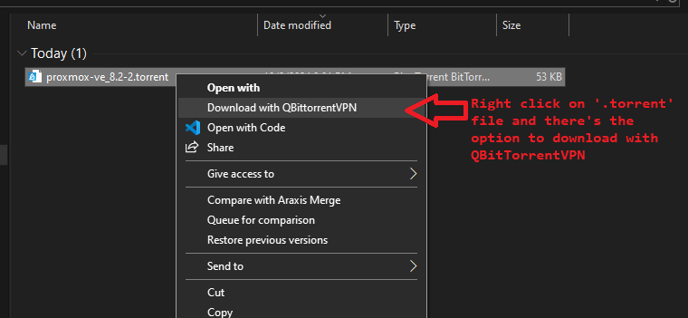
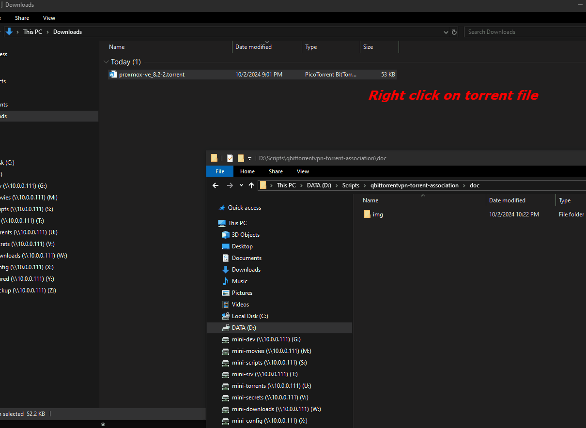

# qbittorrentvpn-torrent-association

## Overview

The `qbittorrentvpn-torrent-association` project provides a convenient way to automate the process of adding torrent files to the qBittorrentVPN download list. This project includes two PowerShell scripts: `Install.ps1` and `Invoke-DownloadTorrentFile.ps1`.

The **Install.ps1** script sets up your environment by copying the necessary script to a system directory, adding an association for `.torrent` files to add them to qBittorrentVPN directly, and integrating a context menu for easy usage. The **Invoke-DownloadTorrentFile.ps1** script is used to programmatically add a torrent to the download list.

## Purpose of the Project

This project aims to streamline the process of adding torrents to a qBittorrentVPN server by:
- Allowing users to add torrent files by right-clicking them directly in Windows Explorer.
- Automating the process through a command-line tool, providing better flexibility and automation capabilities.
- Simplifying the integration with qBittorrentVPN through PowerShell scripting.

## Scripts Description

### 1. `Install.ps1`

The `Install.ps1` script performs the following actions:
- **Copies `Invoke-DownloadTorrentFile.ps1` to a system scripts directory**: The script is copied to the directory specified in the `SYSTEM_SCRIPTS_PATH` environment variable, allowing easy access by the system.
- **Checks if the script is run with administrator privileges**: Since the script makes modifications to the Windows registry, administrator privileges are required.
- **Adds a context menu option for `.torrent` files**: The script adds an entry to the Windows context menu for `.torrent` files, named "Download with QBittorrentVPN." This option will invoke the `Invoke-DownloadTorrentFile.ps1` script and pass the selected torrent file path as an argument.

#### Usage:
Run `Install.ps1` in an elevated PowerShell window (with administrator privileges):
```powershell
pwsh.exe -File "Install.ps1"
```

After running this script, you will be able to right-click on any `.torrent` file and choose "Download with QBittorrentVPN" to add it directly to the qBittorrentVPN download list.




### 2. `Invoke-DownloadTorrentFile.ps1`

The `Invoke-DownloadTorrentFile.ps1` script is responsible for adding a given `.torrent` file to the download list of a qBittorrentVPN server.

- **Parameters**:
  - `-TorrentFilePath [string]` (Mandatory): The full path to the torrent file to be added.
  - `-ServerAddress [string]` (Optional): The address of the qBittorrentVPN server. Default is `10.0.0.111`.
  - `-ServerPort [int]` (Optional): The port of the qBittorrentVPN server. Default is `8080`.

- **Behavior**:
  - The script sends the torrent file to the qBittorrentVPN server using the Web API.
  - On success, a message box appears indicating "Torrent added successfully!" and provides an option to open the qBittorrentVPN web interface.
  - On failure, an error message box is displayed with relevant information.

#### Usage:
Run `Invoke-DownloadTorrentFile.ps1` with PowerShell, passing the path to the torrent file as an argument:
```powershell
pwsh.exe -NoProfile -NonInteractive -File "D:\Scripts\SystemScripts\Invoke-DownloadTorrentFile.ps1" -TorrentFilePath "C:\Users\guillaumep\Downloads\proxmox-ve_8.2-2.torrent"
```

This command will add the specified torrent to the qBittorrentVPN download list, and you will be prompted to open the qBittorrentVPN web interface upon success.

## Requirements

- **PowerShell Core** (`pwsh.exe`) or **Windows PowerShell**.
- **Administrator Privileges** to run the `Install.ps1` script.
- **qBittorrentVPN** must be set up with Web API access enabled, and the server should be accessible on the network.

## Features

- **Automated Torrent Addition**: Automatically add torrent files to qBittorrentVPN from Windows Explorer.
- **Context Menu Integration**: Easily add torrents by right-clicking `.torrent` files and selecting the context menu option.
- **User-Friendly Feedback**: Displays success and error messages with interactive message boxes.

## Installation

1. Clone or download the repository.
2. Open PowerShell **as Administrator**.
3. Run `Install.ps1` to set up the system and context menu integration:
   ```powershell
   pwsh.exe -File "Install.ps1"
   ```

## Example Workflow

1. Right-click on a `.torrent` file.
2. Select **"Download with QBittorrentVPN"** from the context menu.
3. The `Invoke-DownloadTorrentFile.ps1` script is executed, adding the torrent to the qBittorrentVPN server.
4. On success, a prompt asks if you want to open the qBittorrentVPN web interface.

## License

This project is licensed under the MIT License.

## Author

Guillaume Plante

## Contributing

Contributions are welcome! Please submit a pull request or open an issue to suggest improvements or report bugs.

## Contact

For any questions or issues, please contact Guillaume Plante.

## Demo

